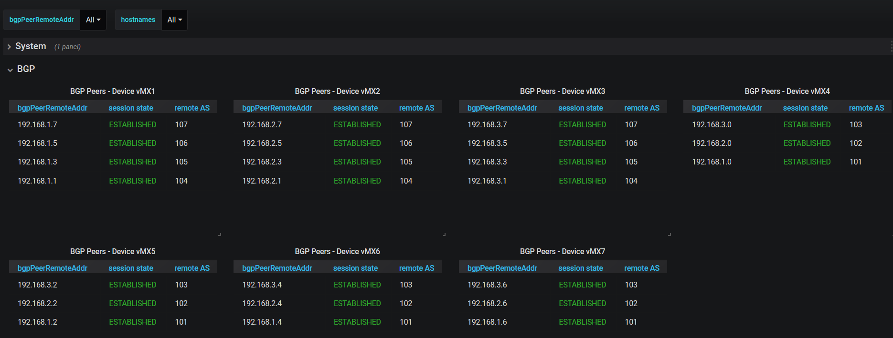
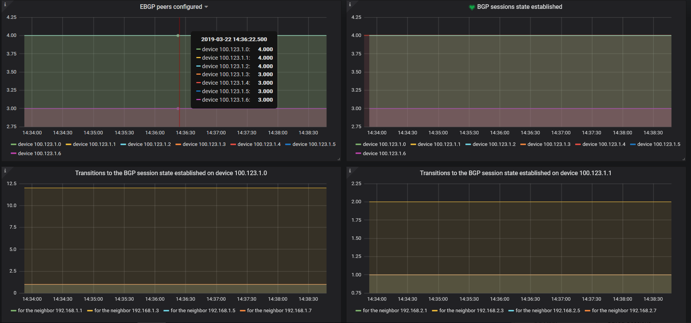
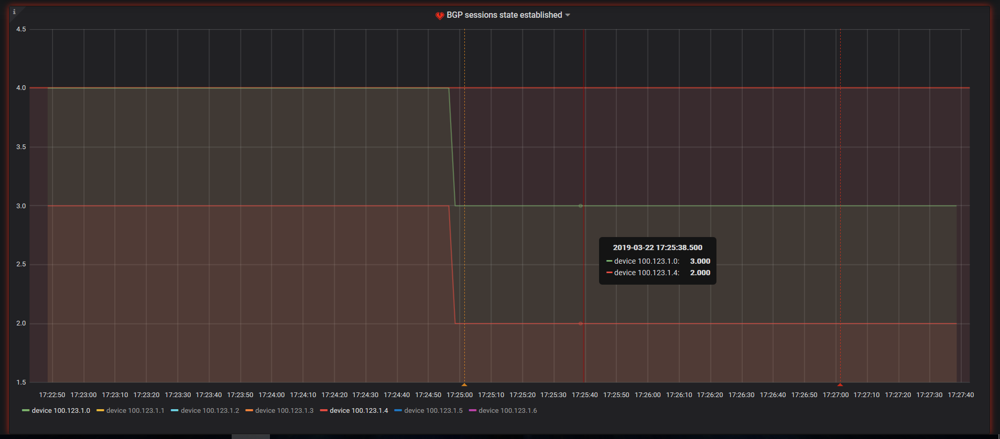
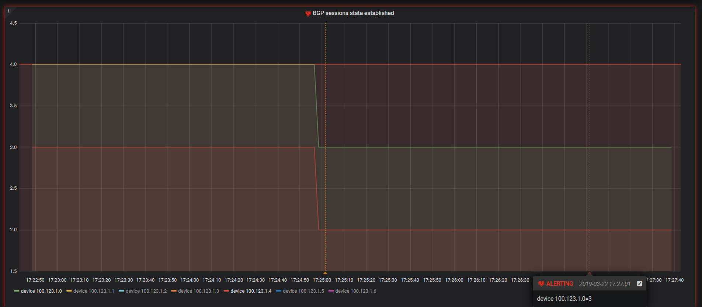
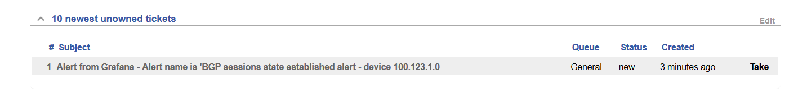
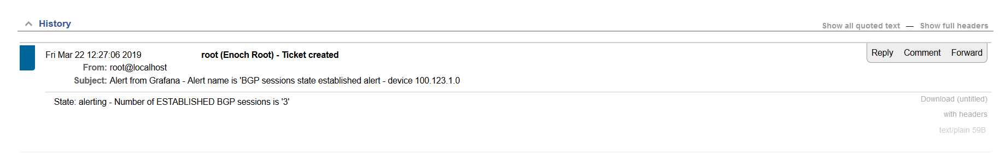

This repository is about **Event driven automation with a TIG stack and SaltStack**.   

Visit [**wiki**](https://github.com/ksator/event_driven_automation_with_a_TIG_stack/wiki) for instructions  

Lab topology
  

BGP (data pulled with SNMP)
  

BGP (data pushed with Openconfig)
  

Grafana is configured to send a webhook notification (HTTP POST with a JSON body) to SaltStack when one of the spine has less than 4 BGP sessions established.  
SaltStack is configured to manage automatically tickets on Request Tracker.   

Let's break the BGP session between the spine vMX1 and the leaf vMX5 is not anymore established.  
So the number of established BGP session on vMX1 is now 3 and the number of established BGP session on vMX5 is now 2  
So Grafana is altering (so it sent a webhook notification to SaltStack)  
  
  
 
SaltStack created a ticket on Request Tracker, and updated the ticket with some details.     
  
  

